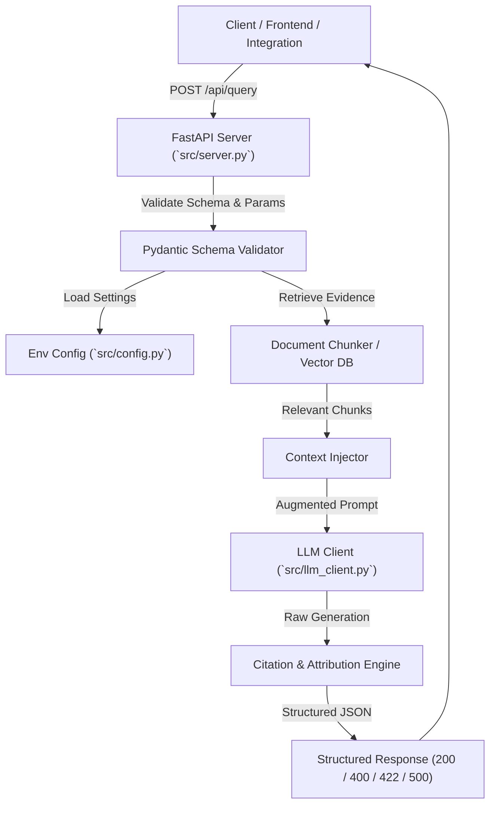

# Backend REST API for RAG Service Documentation

## 1. Overview & Architecture

The **Backend REST API for RAG Service** provides a production-grade, FastAPI-powered query interface that connects frontend applications, API consumers, and automated evaluation pipelines with the core Retrieval-Augmented Generation (RAG) engine.



---

## 2. API Endpoints Specification

### 2.1 Core Query Endpoint: `POST /api/query` (and alias `POST /query`)

#### Request Schema (`QueryRequest`):
```json
{
  "question": "What is the capital adequacy requirement for Tier 1 capital under the framework?",
  "top_k": 3,
  "temperature": 0.2,
  "use_mock": false,
  "filter_doc_id": null,
  "filter_section": null
}
```

| Parameter | Type | Required | Default | Description |
|---|---|---|---|---|
| `question` | string | **Yes** | — | Non-empty user query or question to be answered. |
| `top_k` | integer | No | `3` | Number of context chunks to retrieve (`1 <= top_k <= 50`). |
| `temperature` | float | No | `0.2` | Generation temperature (`0.0 <= temperature <= 2.0`). |
| `use_mock` | boolean | No | `false` | Deterministic offline generation for testing. |
| `filter_doc_id` | string | No | `null` | Optional document ID filter. |
| `filter_section` | string | No | `null` | Optional document section title filter. |

#### Response Schema (`QueryResponse`):
```json
{
  "status": "success",
  "question": "What is the capital adequacy requirement for Tier 1 capital under the framework?",
  "answer": "The capital adequacy requirement for Tier 1 capital is a minimum of 10.5% at all times for financial institutions [1].",
  "sources": [
    {
      "doc_id": "SAMPLE_BANKING_REGULATION",
      "filename": "sample_banking_regulation.txt",
      "section": "Section 2: Liquidity and Capital Requirements",
      "page_number": 2,
      "chunk_id": "SAMPLE_BANKING_REGULATION#chunk_003",
      "text": "## Section 2: Liquidity and Capital Requirements\nFinancial institutions must maintain a Tier 1 Capital Ratio of at least 10.5% at all times...",
      "similarity_score": 0.9,
      "start_char": 561,
      "end_char": 956
    }
  ],
  "confidence": "high",
  "is_grounded": true,
  "metadata": {
    "model": "openai/gpt-4o-mini",
    "latency_ms": 142.5,
    "tokens_used": {
      "prompt_tokens": 495,
      "completion_tokens": 29,
      "total_tokens": 524
    },
    "total_sources_retrieved": 3,
    "retrieval_strategy": "vector_hybrid",
    "timestamp": "2026-09-09T09:31:38.609522+00:00"
  }
}
```

---

### 2.2 Configuration Endpoint: `GET /api/config`

Returns running application parameters with secrets safely masked:
```json
{
  "status": "success",
  "config": {
    "openai_api_base_url": "https://openrouter.ai/api/v1",
    "openai_api_key": "sk-or-v...27bf",
    "chat_model": "openai/gpt-4o-mini",
    "embedding_model": "text-embedding-3-small",
    "chroma_db_path": "./chroma_db",
    "vector_collection_name": "document_chunks",
    "server_host": "0.0.0.0",
    "server_port": 8000,
    "debug_mode": false,
    "default_top_k": 3,
    "default_temperature": 0.2,
    "max_answer_tokens": 300
  }
}
```

---

### 2.3 Status & Health Endpoint: `GET /api/status`

Returns system availability, model configuration, and pipeline status.

---

## 3. Input Validation & Error Handling (Task 3)

The API strictly validates inputs and returns standardized JSON error envelopes:

| Status Code | Trigger Condition | Error Response Example |
|---|---|---|
| **400 Bad Request** | Blank or whitespace-only question string | `{"status": "error", "error": "Validation Error", "detail": "Question field is required and cannot be empty."}` |
| **422 Unprocessable Entity** | Missing `question`, negative `top_k`, or out-of-range `temperature` | `{"status": "error", "error": "Validation Error", "detail": [...], "message": "Invalid request payload format or parameters."}` |
| **500 Internal Server Error** | Unhandled downstream exceptions | `{"status": "error", "error": "Internal Server Error", "detail": "...", "message": "An unexpected server error occurred."}` |

---

## 4. Environment-Driven Configuration (Task 4)

All pipeline parameters, model identifiers, API keys, and server options are loaded from `.env` or system environment variables without hardcoded values:

```bash
# .env Configuration Keys
OPENAI_API_BASE_URL=https://openrouter.ai/api/v1
OPENAI_API_KEY=your_api_key_here
CHAT_MODEL=openai/gpt-4o-mini
EMBEDDING_MODEL=text-embedding-3-small
CHROMA_DB_PATH=./chroma_db
VECTOR_COLLECTION_NAME=document_chunks
SERVER_HOST=0.0.0.0
SERVER_PORT=8000
DEFAULT_TOP_K=3
DEFAULT_TEMPERATURE=0.2
MAX_ANSWER_TOKENS=300
```

---

## 5. Running the API & Verifying Artifacts

### Run Server Locally
```bash
python -m uvicorn src.server:app --host 0.0.0.0 --port 8000 --reload
```

### Run Demonstration & Generate Sample Output Files
```bash
python scripts/run_api_demo.py
```

### Run Pytest Test Suite
```bash
pytest tests/test_api_endpoints.py -v
```
