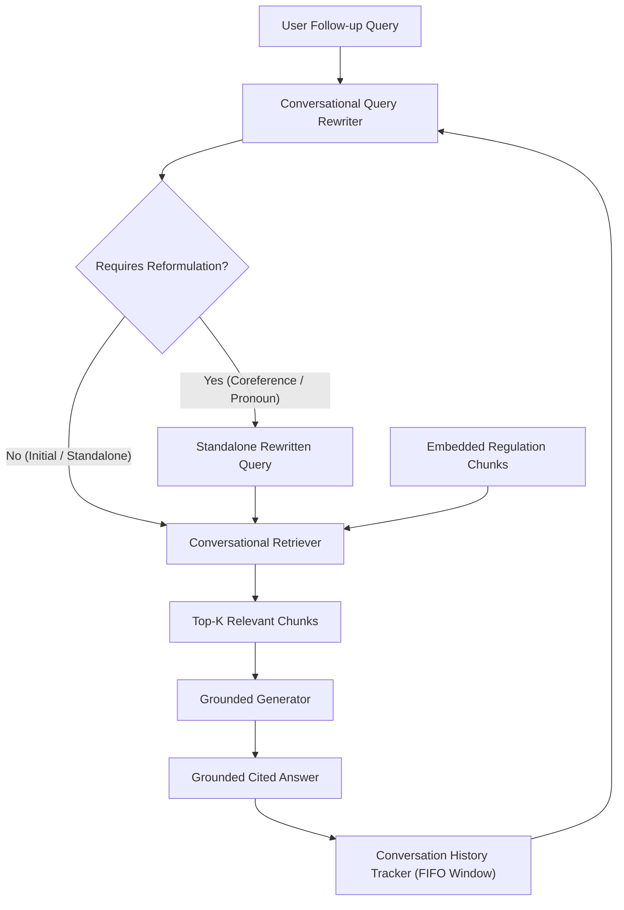

# Conversational RAG & Multi-Turn Query Rewriting Documentation

## 1. Motivation & Problem Statement
In multi-turn conversational interactions, users rarely ask self-contained questions. Instead, follow-up queries naturally contain:
- **Coreference Pronouns**: *"What happens if a bank fails to comply with them?"* or *"What are the exceptions to it?"*
- **Elliptical Fragments**: *"And for routine vendor payments under that threshold?"*
- **Implicit Context**: *"Who has authority to sign off on that override?"*

When passed directly to a dense retriever or vector database, these raw queries result in severe retrieval failure:
1. The pronoun (e.g. *"them"*, *"it"*) lacks the semantic embedding representation of the intended entity (e.g. *"high-value transaction payment authorization thresholds"*).
2. The search engine retrieves irrelevant distractor chunks or generic definitions.
3. Downstream grounded generation fails or falsely triggers missing-context refusals.

The **Conversational RAG & Query Rewriting Engine** solves this by maintaining a structured conversation history, reformulating ambiguous follow-ups into standalone queries, and executing high-precision grounded retrieval.

---

## 2. Core Architecture & Pipeline



---

## 3. Tasks Breakdown

### Task 1 — Track Conversation History
- **Data Models**: `ConversationTurn` and `ConversationHistoryTracker`.
- Tracks:
  - `turn_id`: Sequence position.
  - `user_query`: Original raw user prompt.
  - `assistant_response`: Grounded response provided to user.
  - `rewritten_query`: Standalone query passed to retriever.
  - `is_rewritten`: Boolean flag indicating whether reformulation occurred.
  - `retrieved_chunk_ids`: List of supporting chunk IDs.
  - `citations`: Verified source citations.
  - `similarity_scores`: Retrieval confidence scores.
- **Window Management**: FIFO sliding window (configurable `max_turns=10`) preventing unbounded token growth while providing sufficient context for multi-hop coreference resolution.

### Task 2 — Rewrite Follow-Up Questions into Standalone Queries
- **Prompt Template**: `CONVERSATIONAL_QUERY_REWRITE_SYSTEM_PROMPT` & `CONVERSATIONAL_QUERY_REWRITE_USER_PROMPT`.
- **Coreference Resolution**: Replaces ambiguous pronouns (`it`, `them`, `this rule`, `that override`) with the concrete entity discussed in prior dialogue turns.
- **Elliptical Expansion**: Expands partial phrases into complete, grammatically sound questions.
- **Zero Distortion on Standalone Queries**: Checks if the question is already fully qualified or the first turn; if so, passes it verbatim without latency overhead or hallucinated distortions.
- **Deterministic Heuristic Fallback**: Provides offline, rule-based reformulation for offline testing and deterministic CI/CD environments.

### Task 3 — Retrieve Using the Rewritten Query
- Dual comparative retrieval benchmarks the raw follow-up query against the rewritten standalone query:
  $$\Delta S = S_{\text{rewritten}} - S_{\text{raw}}$$
- **Semantic Score Lift**: Proves positive score gain ($\Delta S > 0$) across ambiguous follow-ups.
- **Target Section Precision**: Demonstrates that rewritten queries accurately retrieve target regulatory sections (`Section 3: High-Value Authorizations`), whereas raw queries retrieve loosely aligned distractors (`Section 1` or `Section 2`).

### Task 4 — Demonstrate Multi-Turn Dialogue
Demonstrates a 4-turn sequential dialogue across the Global Banking Compliance & Regulatory Framework:
1. **Turn 1 (Standalone)**: *"What are the rules and approval thresholds for high-value transaction payments?"*
2. **Turn 2 (Pronoun Rewrite)**: *"What happens if a bank fails to comply with them?"* $\rightarrow$ Reformulated to target high-value transaction penalties.
3. **Turn 3 (Elliptical Rewrite)**: *"What about routine vendor payments under that threshold?"* $\rightarrow$ Reformulated to target under-$50,000 approval rules.
4. **Turn 4 (Contextual Rewrite)**: *"Under Basel IV standards, what is the capital reserve requirement and how often must its ratio be calculated?"* $\rightarrow$ Reformulated and retrieved Tier 1 capital & daily LCR reporting.

### Task 5 — Reproducible Output Artifacts
All execution results, dialogue steps, and evaluations are exported to:
- `outputs/sample_dialogue.json`: Full structured JSON dialogue transcript.
- `outputs/sample_dialogue.txt`: Formatted human-readable conversation transcript with side-by-side retrieval metrics.
- `outputs/conversational_rag_results.json`: Full benchmark evaluation results.
- `outputs/conversational_rag_report.md`: In-depth analytical report.

---

## 4. Execution & Verification

### Running the CLI Demonstration:
```bash
python scripts/run_conversational_rag_demo.py
```

### Running the End-to-End Application:
```bash
python src/main.py
```

### Running the Automated Test Suite:
```bash
pytest tests/test_conversational_rag.py -v
```
